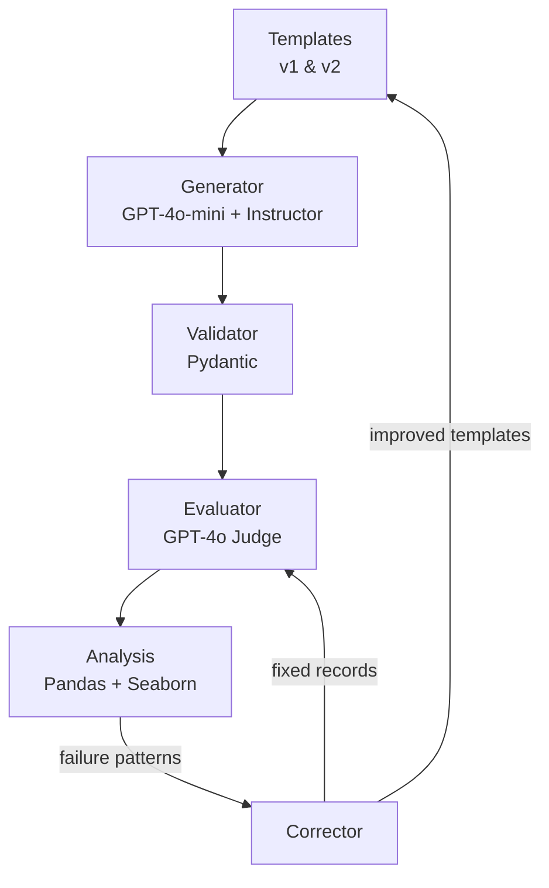

# Closed-Loop Synthetic Data Pipeline

Generate synthetic Q&A training data, evaluate quality with LLM-as-Judge, analyze failure patterns, fix templates upstream, re-evaluate. Applied to Home DIY Repair. 36 failures across 180 evaluations, down to 0 in 4 stages.


<p align="center">
  
</p>

**Live Dashboard:** Deploying in Week 8 of the portfolio sprint. Link will be added here.

## Results

| Stage | Failures (of 180 evals) | Reduction |
|-------|------------------------|-----------|
| V1 generation | 36 (20.0%) | baseline |
| V1 + individual correction | 12 | −67% |
| V2 templates | 8 (4.4%) | −78% from baseline |
| V2 + correction | **0** | −100% |

Inter-rater agreement (LLM judge vs manual labels): 81.7%.

V1 had two dominant failure modes: `incomplete_answer` (50%) and `poor_quality_tips` (43%). Both concentrated in plumbing and HVAC. Electrical had zero failures because its template was already specific enough. Once I found the cluster, I fixed the template that produced it.

<p align="center">
  
</p>

Individual correction alone hit 66.7% reduction. Template improvement is the higher-leverage fix: it eliminates failure classes at the source instead of patching outputs one at a time. The combined pipeline (template improvement + individual correction) reached 0.

<p align="center">
  
</p>

### Sample record (before and after correction)

See [`data/corrected/`](data/corrected/) for full before/after pairs. See [`data/generated/batch_v2.json`](data/generated/batch_v2.json) for the final V2 output.

## Known Gaps

**No human-in-the-loop review.** 81.7% agreement means ~18% of judge calls are wrong. Good enough for finding failure patterns in bulk. Not good enough for deciding whether a specific record passes. A review step between judge evaluation and correction would close this.

**No drift monitoring.** Templates degrade as the domain shifts. A random-sample re-evaluation on each pipeline run would catch this. The closed-loop pattern holds, but calibration needs to be continuous, not one-shot.

## Architecture



30 records total (5 categories × 3 difficulties × 2 each). Pydantic validates structure before anything reaches the judge. Field validators (min_length, pattern matching) catch structural issues before LLM evaluation, creating a two-stage quality gate.

Instructor handles auto-retry on validation failure, so generation success rate is 100% with zero manual JSON parsing.

I calibrated the LLM judge using dual labeling (manual + LLM). Out-of-box GPT-4o judging was unreliable. It swung between 0% and 20% failure rates on the same data. After tuning the judge prompt, agreement stabilized.

## Decisions

| ADR | Decision | Trade-off |
|-----|----------|-----------|
| [ADR-001](docs/adr/ADR-001-instructor-over-raw-openai.md) | Instructor over raw OpenAI | Auto-retry on validation failure, no manual parsing |
| [ADR-002](docs/adr/ADR-002-flat-schema-over-nested-models.md) | Flat schema over nested models | Simpler validation, matches spec exactly |
| [ADR-003](docs/adr/ADR-003-judge-prompt-calibration.md) | LLM-as-Judge calibration | Dual labeling exposed unreliable out-of-box judging |
| [ADR-004](docs/adr/ADR-004-template-improvement-correction.md) | Template improvement over individual fixes | Upstream fixes (−78%) beat downstream patches (−67%) |

## Quick Start

```bash
# Install dependencies and configure environment (requires uv)
uv sync
cp .env.example .env  # Add your OPENAI_API_KEY

# Run the pipeline
uv run python -m src.generator      # Generate 30 V1 records
uv run python -m src.evaluator      # Evaluate with LLM judge (GPT-4o)
uv run python -m src.corrector      # Full 4-stage pipeline: V1→correct→V2→correct
uv run python -m src.analysis       # Generate charts + metrics.json

# Launch demo
uv run streamlit run streamlit_app.py
```

---

Part of a [9-project AI engineering sprint](https://github.com/rubsj/ai-portfolio). Built Feb–May 2026.

Built by **Ruby Jha** · [LinkedIn](https://linkedin.com/in/jharuby) · [GitHub](https://github.com/rubsj/ai-portfolio)
