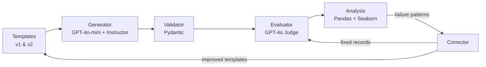

# P1: Synthetic Data Generation — Home DIY Repair

> Closed-loop pipeline that generates synthetic Q&A data, evaluates quality with LLM-as-Judge, and self-corrects — reducing failures from 20% to 0%.


<p align="center">
  
</p>

## Key Results

**The 36 → 8 → 0 story:** V1 templates produced 36 failures across 180 evaluations. Failure pattern analysis revealed `incomplete_answer` (50%) and `poor_quality_tips` (43%) as dominant modes. Improved V2 templates cut failures to 8 (−78%). Targeted correction of remaining 8 brought the total to **0** (−100%).

| Metric | Value |
|--------|-------|
| Records Generated | 30 (5 categories x 3 difficulties x 2 each) |
| V1 Failure Rate | 20.0% (36/180 evaluations) |
| V2 Failure Rate | 4.4% (8/180) — 77.8% reduction |
| Final Rate (V2 + Correction) | **0.0%** — 100% reduction |
| Inter-rater Agreement | 81.7% (LLM judge vs human labels) |

## Why This Matters

High-quality training data is the bottleneck for most AI applications. Manual data creation is slow and expensive; naive LLM generation produces inconsistent quality. This project demonstrates a **closed-loop quality system** — the same pattern used in production ML pipelines at scale: generate → evaluate → analyze failure modes → fix upstream templates → verify. The 36 → 0 result validates the loop — and the pattern generalizes to any domain where LLM-generated data needs quality guarantees.

## Architecture



**Execution flow:** Generate 30 records (GPT-4o-mini) → Validate schemas (Pydantic) → Label quality (GPT-4o judge + manual) → Analyze failure patterns → Improve templates (V2) → Re-generate → Correct remaining failures → Re-evaluate → 0 failures

## Engineering Practices

- **4 Architecture Decision Records** — every major technical choice documented with context, alternatives considered, and rationale
- **Pydantic v2 schemas** — structural validation catches hallucinations before they reach evaluation
- **LLM-as-Judge calibration** — dual labeling (manual + LLM) achieved 81.7% inter-rater agreement, proving judge reliability
- **Caching layer** — MD5-keyed JSON cache prevents redundant API calls during development iteration
- **Schema tests** — validation logic covered by unit tests (test_schemas.py)

## Failure Analysis

The evaluation pipeline identified two dominant failure modes across V1 generation:

<p align="center">
  
</p>

`incomplete_answer` (50% of failures) and `poor_quality_tips` (43%) concentrated in plumbing and HVAC categories. `electrical_repair` had zero failures — its template was already specific enough, providing evidence that **template specificity directly correlates with output quality**.

### Correction Pipeline Results

<p align="center">
  
</p>

V2 template improvements eliminated 78% of failures at the source. Targeted correction of the remaining 8 records achieved 100% resolution — proving that **upstream fixes + downstream correction** together form a complete quality loop.

## Architecture Decisions

| ADR | Decision | Key Insight |
|-----|----------|-------------|
| [ADR-001](docs/adr/ADR-001-instructor-over-raw-openai.md) | Instructor over raw OpenAI | Auto-retry on validation failure → 100% generation success rate |
| [ADR-002](docs/adr/ADR-002-flat-schema-over-nested-models.md) | Flat schema over nested models | Simpler validation, matches spec exactly |
| [ADR-003](docs/adr/ADR-003-judge-prompt-calibration.md) | LLM-as-Judge calibration | Dual labeling exposed 81.7% agreement after tuning |
| [ADR-004](docs/adr/ADR-004-template-improvement-correction.md) | Template improvement strategy | Upstream fixes (−78%) outperform downstream patches (−67%) |

## Tech Stack

**Core:** Python 3.12 · Pydantic v2 · Instructor · OpenAI (GPT-4o-mini generation, GPT-4o evaluation)
**Analysis:** Pandas · Seaborn · Matplotlib
**Demo:** Streamlit

## Quick Start

```bash
# Clone and navigate
git clone https://github.com/rubsj/ai-portfolio.git
cd ai-portfolio/01-synthetic-data-home-diy

# Install dependencies (requires uv)
uv sync

# Run the pipeline
uv run python -m src.generator      # Generate 30 records
uv run python -m src.evaluator      # Run LLM judge
uv run python -m src.analysis       # Generate charts
uv run python -m src.corrector      # Run correction loop

# Launch demo
uv run streamlit run streamlit_app.py

```

> **Note:** Requires an `OPENAI_API_KEY` in `.env` to run generation and evaluation.

## Project Structure

```
01-synthetic-data-home-diy/
├── CLAUDE.md                          # Project-specific Claude Code memory
├── PRD.md                             # Implementation contract
├── pyproject.toml                     # Dependencies
├── streamlit_app.py                   # Interactive demo app
├── src/
│   ├── schemas.py                     # Pydantic models (DIYRepairRecord, JudgeResult, etc.)
│   ├── templates.py                   # 5 prompt templates (v1 and v2)
│   ├── generator.py                   # Instructor-based generation + caching
│   ├── validator.py                   # Validation tracking + rejection logging
│   ├── evaluator.py                   # LLM-as-Judge + agreement analysis
│   ├── corrector.py                   # Individual correction + template improvement
│   └── analysis.py                    # Pandas analysis + chart generation
├── tests/
│   └── test_schemas.py                # Schema validation tests
├── data/
│   ├── cache/                         # LLM response cache (JSON)
│   ├── generated/                     # batch_v1.json, batch_v2.json
│   ├── labels/                        # LLM + manual labels, agreement report
│   └── corrected/                     # Corrected records
├── results/
│   ├── charts/                        # 7 PNG visualizations
│   ├── metrics.json                   # Summary metrics
│   └── correction_comparison.json     # Pipeline stage comparison
└── docs/
    ├── adr/                           # 4 Architecture Decision Records
    └── screenshots/                   # Streamlit app screenshots
```

## Key Insights

1. **LLM-as-Judge requires calibration, not trust** — Out-of-box GPT-4o judging swung between 0% and 20% failure rates. Dual labeling with manual ground truth exposed the gap. 81.7% agreement post-calibration.

2. **Fix upstream, not downstream** — Template improvement (V2) reduced failures by 78%. Individual record correction only achieved 67%. Improving the source always beats patching outputs.

3. **Failure modes cluster predictably** — `incomplete_answer` + `poor_quality_tips` = 78% of all failures. Once you find the cluster, you can fix the template that produces it.

4. **Structured outputs eliminate parsing code** — Instructor's auto-retry with validation error feedback meant zero manual JSON parsing and 100% generation success rate.

5. **Pydantic as first-pass filter** — Field validators (min_length, pattern matching) caught structural issues before LLM evaluation, creating a two-stage quality gate.

---

**Part of [AI Portfolio Sprint](../README.md)** — 9 projects in 8 weeks demonstrating production AI/ML engineering.
